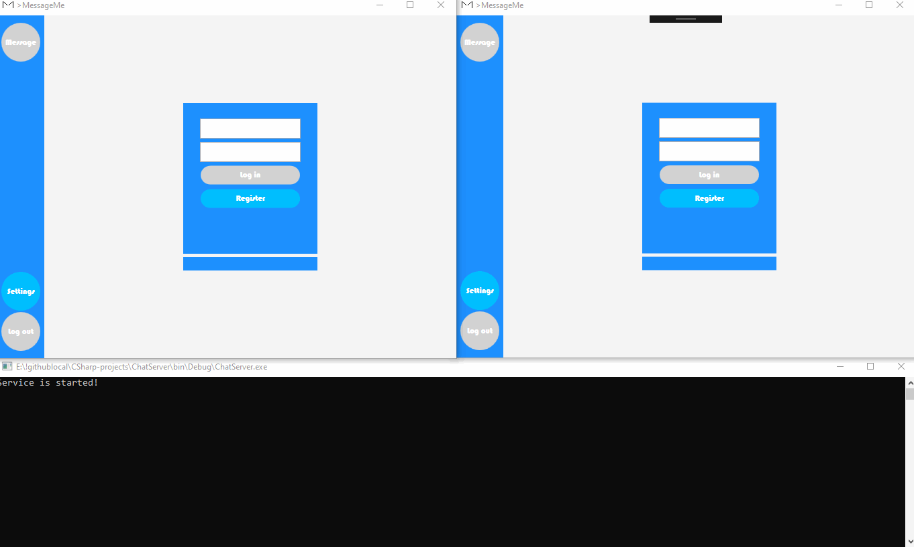

# С# WPF/WCF чат
Клиент и сервер чата написанного с использованием WPF и WCF. Для упрощения работы с WPF и удобной реалзиации MVVM используется фреймворк Caliburn Micro.

Чат имеет следующий функционал: 
—Авторизация по логину/паролю (без защиты соединения); 
—Личный чат с выбранным пользователем; 
—Загрузка истории сообщений, хранимой на сервере. Запрос истории сообщений происходит при переключении контакта; 
—Сортировка списка контактов по дате последнего сообщения при получении/отправке нового сообщения; 
—Разделение "облаков" сообщений отправителя/получателя в разные стороны экрана;

Для корректной работы приложения сервер необходимо запустить от имени администратора.

Настройки сервера производятся с помощью файла App.config.

Логин / Пароль для входа: 
Jack / 12; 
John / qwert; 
Victor / 1234; 
Sergey / qwerty 	

Работа приложения:

